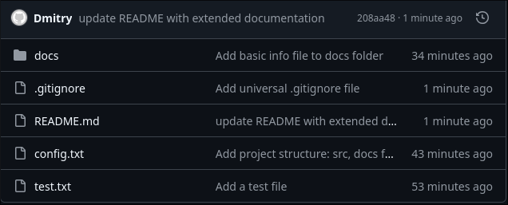

# Проєкт: Практика Git та GitHub

## Короткий опис проєкту
Цей репозиторій створено для виконання практичної роботи з вивчення базових та просунутих функцій системи контролю версій Git та платформи GitHub.

## Призначення репозиторію
Мета репозиторію — продемонструвати навички:
* Встановлення та налаштування Git.
* Налаштування безпечного SSH-з'єднання з GitHub.
* Структурна організація проєкту (папки, файли різних типів).
* Ефективна робота з гілками (створення нової гілки, внесення змін, злиття/merge).
* Створення зрозумілої історії комітів.

## Скріншот роботи


## Основний Функціонал
Цей репозиторій містить:
* Базову структуру проєкту (`src`, `docs`).
* Налаштований файл виключень `.gitignore`.
* Повну історію комітів з роботою в окремій гілці.

## Інструкція Запуску та Перевірки
1. **Клонування репозиторію:**
   ```bash
   git clone git@github.com:USERNAME/repository-name.git

2. **Перевірка SSH-з'єднання:**
   ```bash
   ssh -T git@github.com

3. **Перегляд детальної історії та гілок:**
   ```bash
   git log --all --decorate --oneline --graph

4. **Перевірка налаштувань Git:**
   ```bash
   git config --list

## Автор
* **ПІБ:** Приз Дмитро Андрійович
* **Група:** П-31
## Completed
